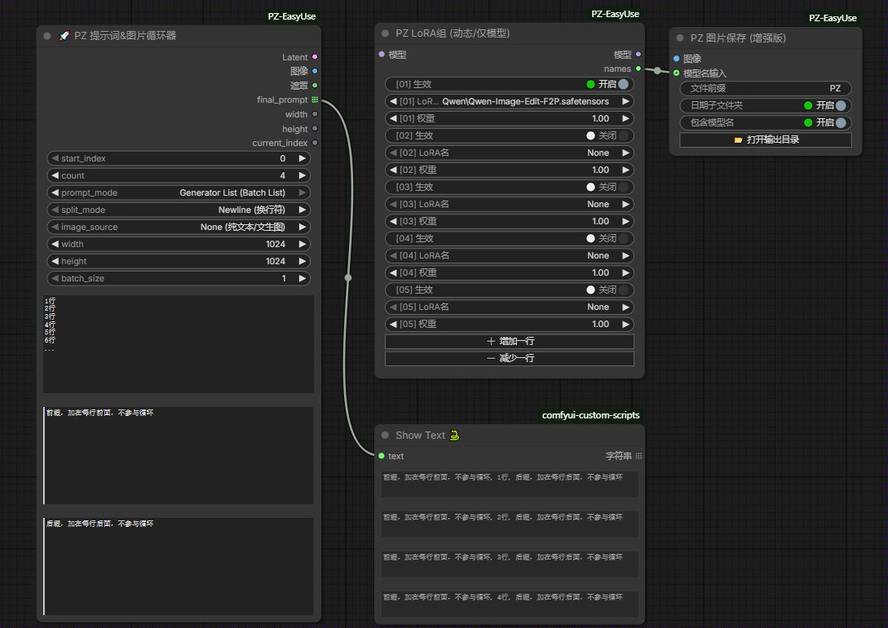

# ComfyUI PZ EasyUse Nodes

  

**PZ EasyUse** 是一套专为 **ComfyUI** 设计的高效工具节点包，旨在简化繁琐的工作流操作。
2026年1月24日：
更新增加了提示词选择器和lora选择器的单选和多选切换功能，修改了多个循环器互相影响的BUG。
2026年1月24日：
更新增加了提示词循环器单独纯文本版:PZ Commander (纯文本版)
2026年1月23日：
更新增加了Generator List (Batch List)

Iterate (JS Loop)：经典的“JS 帮你按多次按钮”。

Generator List (Batch List)：“生成数组/List，一次给 K 采样器，一次任务出多张图”。暂只支持文本，多图请用Iterate (JS Loop)。

## 📸 Workflow (工作流演示)
<!-- 这里放你的图片 -->

其中最核心的组件 **PZ Commander (提示词&图片循环器)** 提供了强大的批量自动化功能，支持纯文本 Prompt 循环和“目录级”的批量图生图，是进行风格测试、模型对比和批量生产的利器。

## ✨ 核心亮点 (Key Features)

*   🚀 **PZ Commander (全能循环器)**:
    *   **Prompt 批量循环**: 在一个文本框内粘贴多行 Prompt，一键自动逐行执行，无需手动切换(异步多任务挂起)。
    *   **批量图生图**: 指定本地文件夹路径，自动循环读取文件夹内的图片进行逐张处理(异步多任务挂起)。暂只支持Iterate (JS Loop)模式
    *   **JS 自动调度**: 独家内置 JS 队列劫持技术，一次点击 Queue 即可自动派发成百上千个任务。
    *   **极简模式**: 支持纯文生图 (Text-Only) 和 批量目录 (Directory Batch) 模式切换。
*   🎨 **LoRA & Prompt 动态组**: 支持多达 50 组的动态 LoRA 和 Prompt 加载器，告别面条式连线。
*   💾 **智能保存**: 增强版图片保存节点，支持自定义前缀和更灵活的路径管理。
*   📐 **分辨率选择**: 预设常用 SD1.5/SDXL 分辨率，一键设置。

## 📦 安装方法 (Installation)
### 方法 1: 手动安装
下载压缩包，解压缩后文件夹名字去掉-main，放入custom_nodes，重启comfyui

### 方法 2: 手动安装
1.  进入 ComfyUI 的 `custom_nodes` 目录：
git clone https://github.com/prinzer/ComfyUI-PZ-EasyUse.git  

