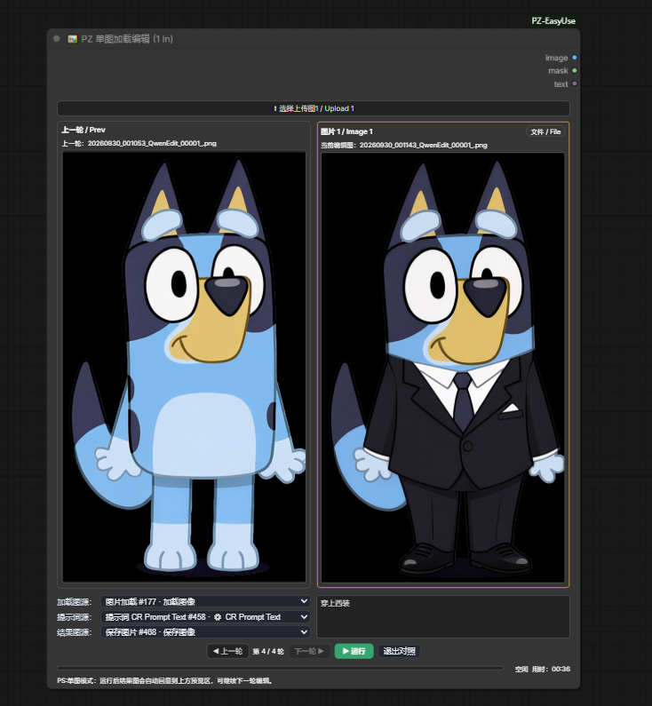
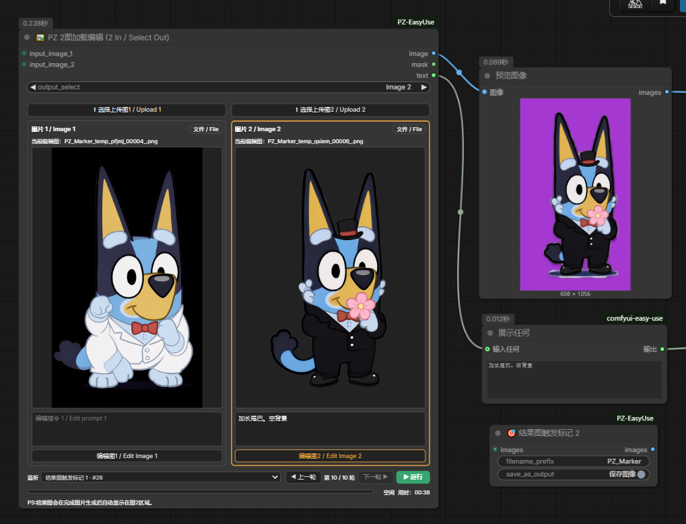
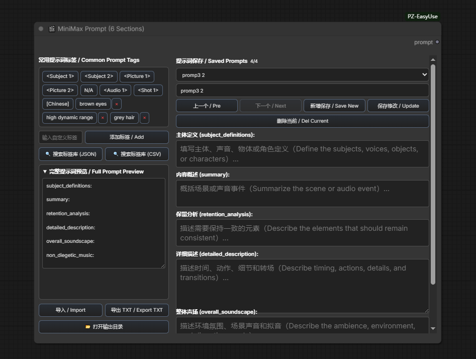
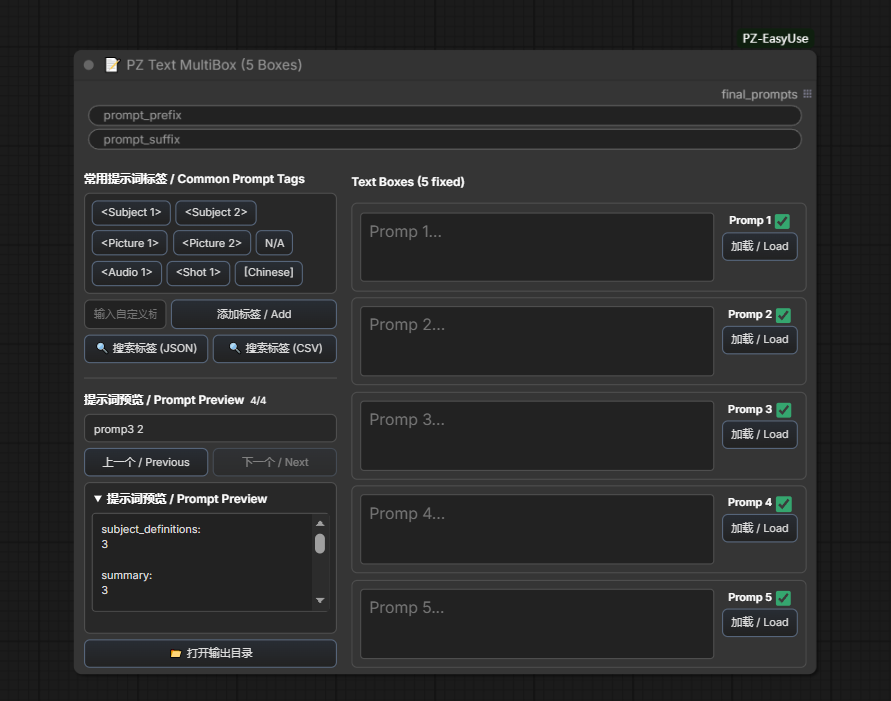
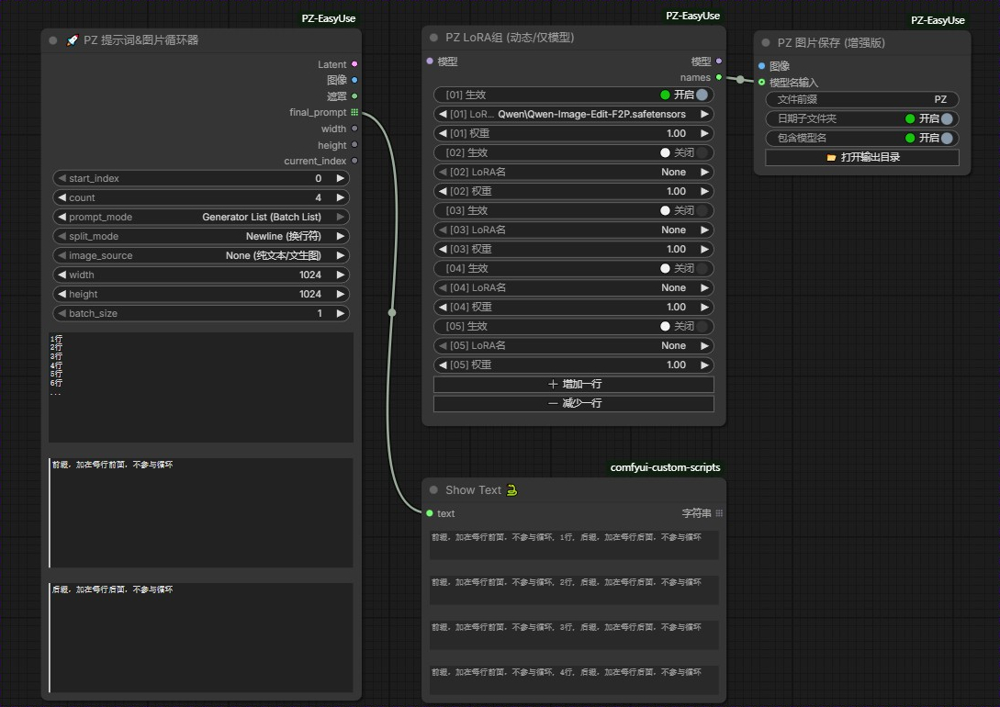

# ComfyUI PZ EasyUse Nodes

**PZ EasyUse** 是一套专为 **ComfyUI** 设计的高效工具节点包，旨在简化繁琐的工作流操作。

2026年9月30日：

新增 **PZ 单图加载编辑 (PZ Single Image Loader)** —— 单图迭代编辑的“零连线”版本，主要功能：

- **自动劫持节点**：自动监听并“劫持”工作流中的「图片加载」节点、「提示词」文本节点、「保存图片」节点，**无需做任何连线**，把节点放进工作流区即可直接运行。
- **可手动更改劫持目标**：底部 `加载图源 / 提示词源 / 结果图源` 三个下拉可手动指定要劫持的节点，**避免自动劫持到错误的节点**（默认自动选中工作流中的第一个对应节点，可随时改）。
- **迭代闭环**：编辑结果图自动回显到预览区，并写回「加载图源」节点，使整张工作流的源图随编辑迭代更新；`上一轮 / 下一轮` 可回看历史轮次。
- **对照模式**：`对照 / 退出对照` 在原图与结果图之间切换比对。
- 底部显示运行进度与用时。

2026年9月29日：

新增并重构 **PZ 2图加载编辑 (PZ Dual Image Loader)**，并新增配套节点 **🎯 结果图触发标记 (PZ_Listen_Marker)**：

- 一次加载两张图并写编辑指令：图1 为编辑目标（结果图自动回流到图1），图2 为固定参考图，可继续下一轮编辑
- 输出 `image_1 / image_2 / text(STRING)`
- 顶部两个“选择上传图N”按钮；图片框标题下显示 `当前编辑图：xxx.png`；图2 右上角可 `忽略图2`
- 无需连线：自动劫持图片加载 / 提示词 / 保存图片节点，中部绑定下拉可手动更换目标
- 底部 `◀ 上一轮 / 第 N/M 轮 / 下一轮 ▶ / ▶ 运行 / 对照` 按钮；右下角显示本次任务 `用时：00:12`
- 图2 忽略可与绑定的图片加载节点双向同步；被忽略的加载节点仍保留在绑定下拉中并标注“已忽略”
- 结果图触发标记节点：图片透传，接在保存图片前后均可，开关可切换“保存图像 / 预览图像”

2026年9月6日：

更新增加了一个MINIMAX H3 手写提示词小工具PZ MiniMax Prompt (6 Sections)，可以自定义标签快速输入，根据推荐提示词格式分区书写，提示词可以保存在input文件夹下json文件，可导出导入。

2026年9月6日：

更新增加了一个MINIMAX H3 提示词批量循环任务的专用节点PZ text multibox，功能类同Iterate (JS Loop)：经典的“JS 帮你按多次按钮”。区别是这个可以直接快速加载PZ MiniMax Prompt保存的提示词。 分固定5个textbox和动态增加textbox两个版本，textbox单独有生效开关。

2026年1月25日：

更新增加了提示词选择器和lora选择器的单选和多选切换功能，修改了多个循环器互相影响的BUG。

2026年1月24日：

更新增加了提示词循环器单独纯文本版:PZ Commander (纯文本版)

2026年1月23日：

更新增加了Generator List (Batch List)

Iterate (JS Loop)：经典的“JS 帮你按多次按钮”。

Generator List (Batch List)：“生成数组/List，一次给 K 采样器，一次任务出多张图”。暂只支持文本，多图请用Iterate (JS Loop)。

## 📸 Workflow (工作流演示)
<!-- 这里放你的图片 -->

其中最核心的组件 **PZ Commander (提示词&图片循环器)** 提供了强大的批量自动化功能，支持纯文本 Prompt 循环和“目录级”的批量图生图，是进行风格测试、模型对比和批量生产的利器。

## ✨ 核心亮点 (Key Features)

*   🚀 **PZ Commander (全能循环器)**:
    *   **Prompt 批量循环**: 在一个文本框内粘贴多行 Prompt，一键自动逐行执行，无需手动切换(异步多任务挂起)。
    *   **批量图生图**: 指定本地文件夹路径，自动循环读取文件夹内的图片进行逐张处理(异步多任务挂起)。暂只支持Iterate (JS Loop)模式
    *   **JS 自动调度**: 独家内置 JS 队列劫持技术，一次点击 Queue 即可自动派发成百上千个任务。
    *   **极简模式**: 支持纯文生图 (Text-Only) 和 批量目录 (Directory Batch) 模式切换。
*   🖼️ **PZ 2图加载编辑**: 双图加载 + 编辑指令——图1 为编辑目标（结果图自动回流）、图2 为固定参考图（可忽略并与加载节点双向同步）；可监听指定保存图片/标记节点，支持上一轮/下一轮回溯、上一轮对照、进度与用时显示。
*   🖼️ **PZ 单图加载编辑**: 放进工作流区即用、无需连线，自动劫持图片加载 / 提示词 / 保存图片节点；可手动更改劫持目标，结果图自动回流迭代。
*   🎨 **LoRA & Prompt 动态组**: 支持多达 50 组的动态 LoRA 和 Prompt 加载器，告别面条式连线。
*   💾 **智能保存**: 增强版图片保存节点，支持自定义前缀和更灵活的路径管理。
*   📐 **分辨率选择**: 预设常用 SD1.5/SDXL 分辨率，一键设置。

## 🖼️ PZ 2图加载编辑 (Dual Image Loader)

双图迭代编辑的**零连线**版本：用法与 **PZ 单图加载编辑 (Single Image Loader)** 一致，区别是**可同时加载两张图**——图1 是**编辑目标**（结果图自动回流到图1），图2 是**固定参考图**（例如姿势 / 风格参考，不参与回流）。运行后结果图自动回到图1，可继续下一轮编辑。放入工作流区即**自动劫持**图片加载节点、提示词文本节点、保存图片节点，**无需任何连线**；也可手动更改劫持目标。

**图2 忽略双向同步**：不需要参考图时，打开图2 右上角的 `忽略图2`，图2 预览变灰、停止与图2 加载源的双向同步，工作流只使用 `image_1 + 提示词`；该开关会与绑定的图片加载节点**双向同步忽略 / 恢复**（忽略图2 ⇄ 把加载节点 Mute）。被忽略的加载节点仍保留在「图2 加载图绑定」下拉中并标注“已忽略”，不会丢失绑定。兼容 rgthree 节点控制器等节点的 Mute / Bypass 忽略状态。

*PZ 2图加载编辑运行界面：左侧「上一轮」对照 + 中间 图1（编辑目标）+ 右侧 图2（固定参考，可忽略）；中部源选择下拉（图1 / 图2 加载图绑定、提示词绑定、结果图绑定）；底部 `上一轮 / 第 N/M 轮 / 下一轮 / 运行 / 退出对照`*

### 涉及节点

| 节点 | 说明 |
| --- | --- |
| 🖼️ PZ Dual Image Loader (2 In / Select Out) | 双图加载 + 编辑指令，结果图回流到图1 |
| 🎯 结果图触发标记 (PZ_Listen_Marker) | 图片透传，标记“这里的结果图要回流” |

### 主要功能

- **自动劫持图片加载节点**：分别监听图1 / 图2 两个**图片加载**节点，随其换图实时跟随；结果图回流写回图1 的加载节点。
- **自动劫持提示词节点**：自动选中**提示词文本**节点作为编辑指令来源，双向同步。
- **自动劫持保存图片节点**：自动选中保存图片节点，其输出结果图自动回流到本节点图1。
- **无需连线，直接运行**：以上节点全部通过“劫持”自动关联，节点放进工作流区即可跑。
- **可手动更改劫持目标**：中部下拉可分别指定 `图1 加载图绑定 / 图2 加载图绑定 / 提示词绑定 / 结果图绑定`，避免自动劫持到错误节点。
- **迭代闭环**：运行后结果图回流到**图1** 并写回图1 加载节点，使工作流源图随编辑迭代更新；图2 作为**固定参考图不回传**。`上一轮 / 下一轮` 可回看历史轮次。
- **图2 忽略开关**：`忽略图2` 让图2 变灰并退出工作流（仅 `image_1 + 提示词` 参与），可与绑定的加载节点双向同步忽略 / 恢复。
- **对照模式**：`对照 / 退出对照` 把上一轮结果图与当前编辑图并排比对。
- **进度与用时**：右下角显示本次运行 `用时：00:12`。

### 界面说明

1. **顶部**：`⬆ 选择上传图1 / Upload 1`、`⬆ 选择上传图2 / Upload 2`，可为图1 / 图2 手动选择并上传图片；某张图接了上游连线时按钮自动置灰，右上角徽章由 `文件 / File` 变为 `接入 / Linked`（此时图片来自连线）。
2. **预览区（三列）**：
   - 左列 `上一轮 / Prev`：上一轮结果图，用于对照；首轮显示 `已是首轮 / First round`。
   - 中列 `图1 / Image 1`（橙框）：**当前编辑目标**，标题下显示 `当前编辑图：xxx.png`。
   - 右列 `图2 / Image 2`：**固定参考图**，右上角有 `忽略图2` 开关。
3. **源选择（劫持绑定，无需连线）**：节点放入工作流区即自动劫持对应节点，也可手动更改：
   - `图1 加载图绑定`：劫持第一个**图片加载**节点 → 图1 源（结果回流写回它）。
   - `图2 加载图绑定`（双图版独有）：劫持第二个**图片加载**节点 → 图2 参考源。
   - `提示词绑定`：劫持**提示词文本**节点 → 作为编辑指令来源，双向同步。
   - `结果图绑定`：劫持**保存图片 / 标记**节点，接收其输出结果图回流。
   - 每个下拉都有 `— 不监听 —`，选它即停止劫持、改回手动选图。
4. **编辑指令框**：源选择行下方的大文本框，写本轮编辑指令（如“参考图2 姿势图，摆出相同姿势”）。
5. **按钮行**：`◀ 上一轮` / `第 N/M 轮` / `下一轮 ▶`（在本节点历史结果图间前后翻，最多保留 60 轮）、`▶ 运行`（等同工具栏运行）、`对照 / 退出对照`。
6. **说明行**：`结果图在生成完成后自动回流到图1，图2 作为固定参考图不回传，可继续下一轮编辑。`

### 输出

- `image_1` / `image_2`：图1 / 图2 的图片。
- `text`：编辑指令文本（STRING），可直接接到文本 / 提示词输入。

> 输入参数另含 `listen_source`（结果图监听来源：保存图片节点 / 标记节点）与 `disable_image_2`（忽略图2），一般用界面上的开关即可，无需手动改。

### 结果图触发标记 (PZ_Listen_Marker)

- **图片透传**：`IMAGE` 进 → `IMAGE` 出，接在保存图片节点**前面或后面都可以**（它自身是输出节点，一定会执行）。
- **开关 `save_as_output`**：打开 = 等同“保存图像”（写到 output 目录）；关闭 = 等同“预览图像”（写到临时目录，只在本次预览）。
- 节点会自动编号，标题显示 `🎯 结果图触发标记 1 / 2 / 3 …`，方便在“监听”下拉里区分。

### 典型用法

1. `VAE Decode → 🎯 结果图触发标记 → 保存图像`（标记节点接在保存图片前后都行）。
2. 在 Dual Image Loader 的 `结果图绑定` 下拉里选择这个标记节点，或某个保存图片节点。
3. 图1 放编辑目标图、图2 放参考图（不需要参考图就打开 `忽略图2`），写好编辑指令 → 点 `▶ 运行`。
4. 生成结束后结果图自动回流到**图1**，可直接继续改图；`上一轮 / 下一轮` 可回看历史结果，`对照 / 退出对照` 可并排比对上一轮。

> 提示：改动前端 JS 后浏览器按 `Ctrl + F5` 强刷；改动 Python（新增节点/参数）后需要重启 ComfyUI。

## 🖼️ PZ 单图加载编辑 (Single Image Loader)

单图迭代编辑的**零连线**版本：放入工作流区后，**自动劫持**图片加载节点、提示词文本节点、保存图片节点，无需任何连线即可运行；也可以手动更改劫持目标，避免自动劫持到错误的节点。

*PZ 单图加载编辑运行界面：上方结果预览 + 编辑图，底部三行源选择下拉（加载图源 / 提示词源 / 结果图源）与 上一轮 / 下一轮 / 运行 / 对照*

### 主要功能

- **自动劫持图片加载系节点**：自动选中工作流里的图片加载节点，把其图片作为编辑源，随加载节点换图实时跟随。
- **自动劫持提示词节点**：自动选中工作流里的提示词文本节点，作为编辑指令来源，双向同步。
- **自动劫持保存图片节点**：自动选中保存图片节点，其输出结果图自动回显到本节点预览区。
- **无需连线，直接运行**：以上三类节点都通过“劫持”自动关联，不用再拉任何线；节点放进工作流区即可跑。
- **可手动更改劫持节点**：底部三行下拉可分别指定 `加载图源 / 提示词源 / 结果图源`，避免自动劫持到错误节点；默认自动选中工作流里第一个对应节点。
- **迭代闭环**：运行后结果图自动回显，并写回「加载图源」节点，使整张工作流的源图随编辑迭代更新；`上一轮 / 下一轮` 可回看历史轮次。
- **对照模式**：`对照 / 退出对照` 在原图与结果图之间切换比对。
- **进度与用时**：底部显示 `节点 名字：35%` 与 `用时：00:12`。

### 界面说明

1. **顶部**：`⬆ 选择上传图1 / Upload 1`，可为图1手动选择并上传图片。
2. **预览区**：左侧 `上一轮 / Prev` 显示上一轮结果图，右侧 `图片1 / Image 1`（橙框）为当前编辑目标，标题下显示 `当前编辑图：xxx.png`。
3. **源选择（三行下拉）**：
   - `加载图源`：选择要劫持的**图片加载**节点（如 `加载图像`）。
   - `提示词源`：选择要劫持的**提示词文本**节点（如 `CR Prompt Text`）。
   - `结果图源`：选择要劫持的**保存图片**节点，用于接收结果图回流。
   - 每个下拉都有一项 `— 不监听 —`，选它即可停止劫持、改回手动选图。
4. **按钮行**：`◀ 上一轮` / `第 N/M 轮` / `下一轮 ▶` / `▶ 运行` / `对照 / 退出对照`。

> 提示：“自动劫持”默认选中工作流中第一个对应节点；如果劫持到了不想要的节点，直接在对应下拉里改成目标节点即可。

## 📦 安装方法 (Installation)
### 方法 1: 手动安装
下载压缩包，解压缩后文件夹名字去掉-main，放入custom_nodes，重启comfyui

### 方法 2: 手动安装
1.  进入 ComfyUI 的 `custom_nodes` 目录：
git clone https://github.com/prinzer/ComfyUI-PZ-EasyUse.git  

